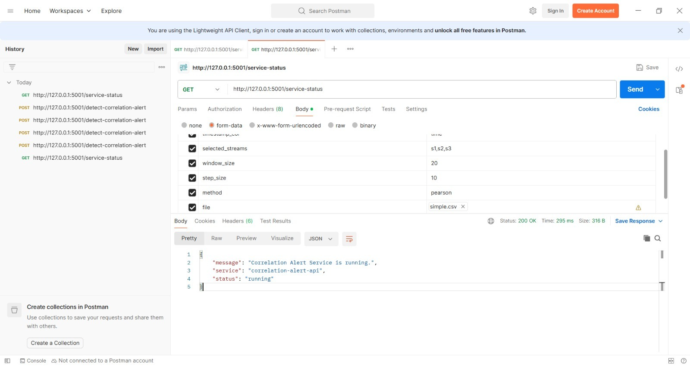
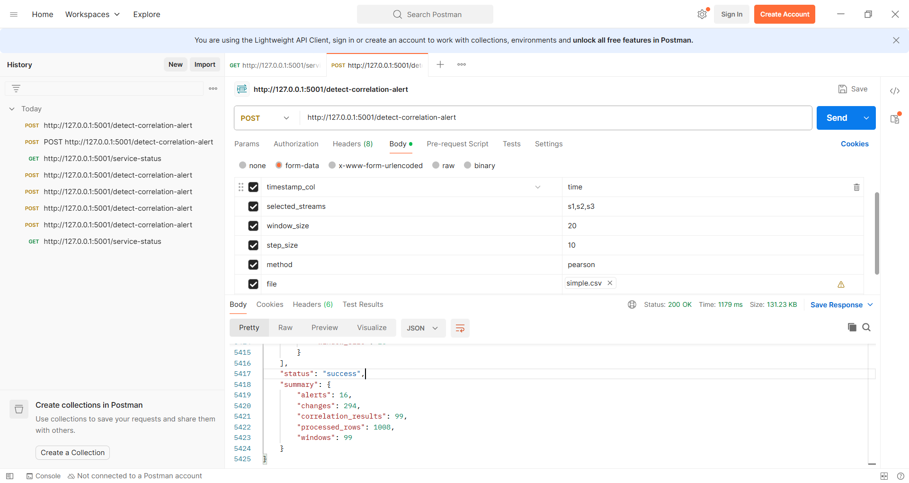
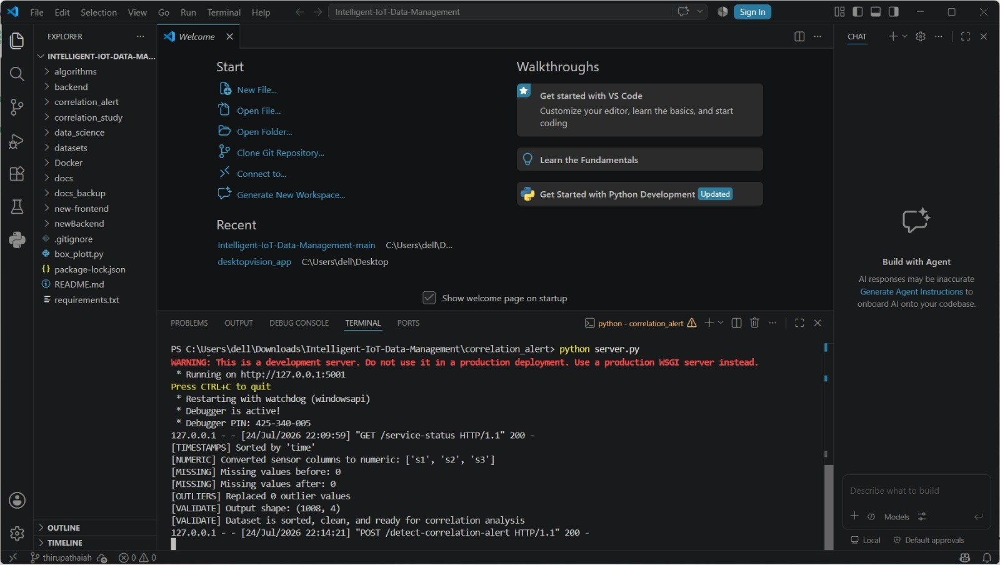

Correlation API Contract Draft

Project: Intelligent IoT Data Management Prepared by: Thirupathaiah
Miriyala Task: Correlation Change Alert API Documentation Date: 25 July
2026

## 1. Objective

The purpose of this document is to describe the JSON response returned
by the Correlation Alert API after a successful POST request to
/detect-correlation-alert. It documents the request parameters, response
structure, field meanings, and integration considerations for the
Analytics Integration team.

## 2. API Endpoint

  -----------------------------------------------------------------------
  Item                                Value
  ----------------------------------- -----------------------------------
  Method                              POST

  Endpoint                            /detect-correlation-alert

  Purpose                             Processes uploaded CSV sensor data
                                      and detects significant correlation
                                      changes.
  -----------------------------------------------------------------------

## 3. Request Parameters

  Parameter          Type       Example
  ------------------ ---------- ------------
  file               CSV File   simple.csv
  selected_streams   String     s1,s2,s3
  window_size        Integer    20
  step_size          Integer    10
  method             String     pearson

## 4. Response Structure

Top-level JSON response fields returned by the API are: - status -
alerts - changes - summary

  -----------------------------------------------------------------------
  Field             Type              Example           Meaning
  ----------------- ----------------- ----------------- -----------------
  status            String            success           Indicates request
                                                        completed
                                                        successfully.

  alerts            Array             \[...\]           Detected
                                                        correlation
                                                        alerts.

  changes           Array             \[...\]           Correlation
                                                        changes
                                                        calculated for
                                                        sliding windows.

  summary           Object            {...}             Overall
                                                        processing
                                                        statistics.
  -----------------------------------------------------------------------

## 5. API Testing Evidence

The Correlation Alert API was tested locally after setting up the
project environment. Both required endpoints were executed successfully
using the provided Postman collection. The GET request confirmed that
the service was running correctly, while the POST request successfully
processed the sample CSV dataset and returned correlation analysis
results.

### Figure 1. Successful GET /service-status request

### Figure 2. Successful POST /detect-correlation-alert request

### Figure 3. Flask Server Terminal

## 6. Alert Object Fields

  Field           Type      Example                  Description
  --------------- --------- ------------------------ ---------------------------------------
  alert_level     String    HIGH                     Severity of alert
  stream_1        String    s1                       First sensor stream
  stream_2        String    s2                       Second sensor stream
  previous_corr   Number    -0.9466                  Previous correlation value
  current_corr    Number    0.6852                   Current correlation value
  delta           Number    1.6319                   Difference between correlation values
  window_index    Integer   15                       Sliding window index
  start_time      String    Timestamp                Window start time
  end_time        String    Timestamp                Window end time
  reason          String    Correlation changed...   Reason for alert

## 7. Summary Object

  Field                 Observed Value
  --------------------- ----------------
  alerts                16
  changes               294
  processed_rows        1008
  windows               99
  correlation_results   99

## 8. Sample JSON Response (Excerpt)

{ "status": "success", "summary": { "alerts": 16, "changes": 294,
"correlation_results": 99, "processed_rows": 1008, "windows": 99 } }

## 9. Integration Notes

Verify the status field before processing results.

Alerts contains significant correlation events.

Changes contains calculated correlation changes.

Summary provides overall processing statistics.

Client applications should handle empty alerts arrays gracefully.

## 10. Questions for Analytics Integration Team

Should every alert include a unique alert_id?

Why are start_time and end_time shown as placeholder timestamps in the
current response?

What is the intended difference between correlation_results and windows?

Should error responses follow a standard JSON schema?

## 11. Setup Issues & Fix

Issue: While testing the POST /detect-correlation-alert endpoint in
Postman, the request initially returned HTTP 415 Unsupported Media Type
and HTTP 500 Internal Server Error.

Cause: The CSV file was not uploaded correctly because the file field in
the Postman form-data request was configured incorrectly.

Fix: The file field was changed to the File type, simple.csv was
uploaded correctly, and the request was sent again. The API then
processed the dataset successfully and returned HTTP 200 OK.
